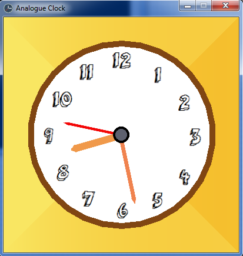

# Analogue-Clock
A clock program written in SFML.

## NOTE:
This program uses SFML. So you must set up SFML before running this.
For setting up SFML you may see [this](https://www.sfml-dev.org/tutorials/2.5/).

## Screenshot

